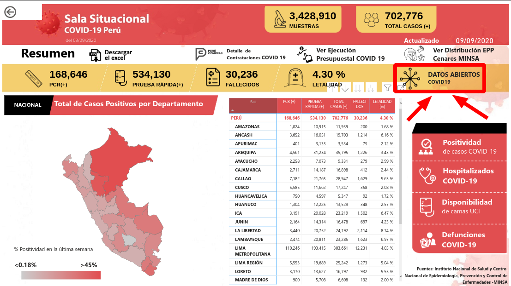

# coronaBichoBot

## Crear Bot
1. buscamos en Telegram		: @BotFather
2. Click en			: Iniciar
3. Para crear nuevo bot escribo	: /newbot
4. Ingreso nombre para mi bot	: coronaBicho
5. Ahora ingreso un username	: coronaBichoBot
6. Me dara un token parecido a	: 12345678910:sdfasiwueiwueiuwehfuiwe
## Para ejecutar el bot
```
$ npm install --save node-telegram-bot-api
$ node index.js
```
## Para intectuar con el bot
1. En Telegram buscamos como: @coronaBichoBot  
	
2. Ya podemos hablarle
3. Por si queremos que nos aparezca el keyboard: /start  
	   
	   
## Data a usar: Minsa
> [Click aquí para acceder a: Sala Situacional COVID-19 Perú](https://covid19.minsa.gob.pe/sala_situacional.asp)

  
  
