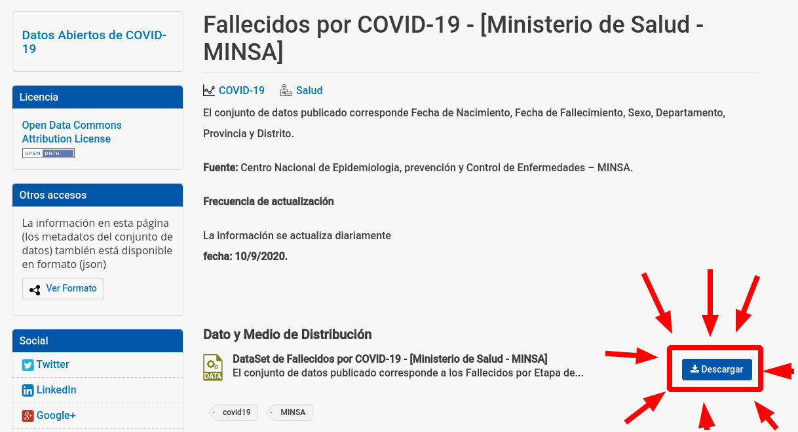
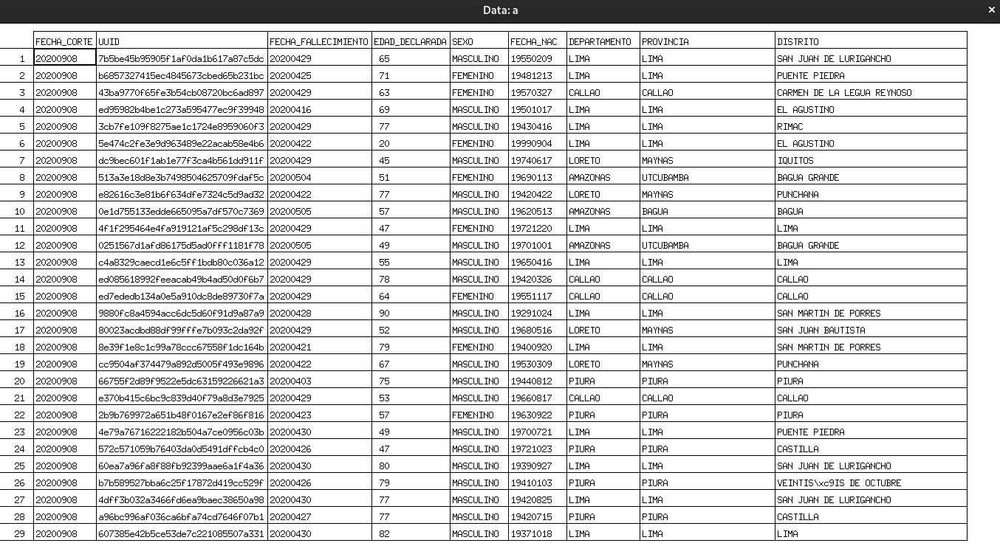

# Datos Abiertos
## Fallecidos por COVID-19-[Ministerio de Salud-MINSA]
> [**Click aquí para acceder**](https://www.datosabiertos.gob.pe/dataset/fallecidos-por-covid-19-ministerio-de-salud-minsa)



> [**Click para descargar la data**](https://cloud.minsa.gob.pe/s/Md37cjXmjT9qYSa/download)
## Ahora a jugar con la data usando R
1. Obtener la data desde la terminal
	1. Descargamos
		```
		$ wget https://cloud.minsa.gob.pe/s/Md37cjXmjT9qYSa/download
		```
	2. Renombro el archivo descargado
		```
		$ mv download fallecidos.csv
		```
2. Iniciamos la consola de R
	```
	$ R
	> 
	```
3. Importamos la data
	```r
	a <- read.csv("fallecidos.csv")
	class(a)
	View(a)
	```
	
4. Personas fallecidas mayor o igual a 65 años
	1. Obtenemos el dataframe correspondiente
		```r
		b<-a$EDAD_DECLARADA>=65
		c<-which(b)
		d<-a[c,]
		View(d)
		```
	2. Porcentaje de personas fallecidas mayores a 65 años 
		```r
		(nrow(d)/nrow(a))*100
		```
5. Lugar geográfico
	1. Visualizar data de un departamento
		```r
		library(stringr)
		library(dplyr)
		b<-filter(a,str_detect(DEPARTAMENTO,"LIMA"))
		nrow(b)
		View(b)
		```
	2. Departamentos
		1. AMAZONAS
			```r
			b<-filter(a,str_detect(DEPARTAMENTO,"AMAZONAS"))
			nrow(b)
			[1] 200
			```
		2. ANCASH
			```r
			b<-filter(a,str_detect(DEPARTAMENTO,"ANCASH"))
			nrow(b)
			[1] 1214
			```
		3. APURIMAC
			```r
			b<-filter(a,str_detect(DEPARTAMENTO,"APURIMAC"))
			nrow(b)
			[1] 75
			```
		4. AREQUIPA
			```r
			b<-filter(a,str_detect(DEPARTAMENTO,"AREQUIPA"))
			nrow(b)
			[1] 1226
			```
		5. AYACUCHO
			```r
			b<-filter(a,str_detect(DEPARTAMENTO,"AYACUCHO"))
			nrow(b)
			[1] 279
			```
		6. CAJAMARCA
			```r
			b<-filter(a,str_detect(DEPARTAMENTO,"CAJAMARCA"))
			nrow(b)
			[1] 412
			```
		7. CALLAO
			```r
			b<-filter(a,str_detect(DEPARTAMENTO,"CALLAO"))
			nrow(b)
			[1] 1629
			```
		8. CUSCO
			```r
			b<-filter(a,str_detect(DEPARTAMENTO,"CUSCO"))
			nrow(b)
			[1] 358
			```
		9. HUANCAVELICA
			```r
			b<-filter(a,str_detect(DEPARTAMENTO,"HUANCAVELICA"))
			nrow(b)
			[1] 92
			```
		10. HUANUCO
			```r
			b<-filter(a,str_detect(DEPARTAMENTO,"HUANUCO"))
			nrow(b)
			[1] 348
			```
		11. ICA (No coincide)
			```r
			b<-filter(a,str_detect(DEPARTAMENTO,"ICA"))
			nrow(b)
			[1] 1594
			```
		12. JUNIN
			```r
			b<-filter(a,str_detect(DEPARTAMENTO,"JUNIN"))
			nrow(b)
			[1] 697
			```
		13. LA LIBERTAD
			```r
			b<-filter(a,str_detect(DEPARTAMENTO,"LA LIBERTAD"))
			nrow(b)
			[1] 2114
			```
		14. LAMBAYEQUE
			```r
			b<-filter(a,str_detect(DEPARTAMENTO,"LAMBAYEQUE"))
			nrow(b)
			[1] 1623
			```
		15. LIMA (Falta separar entre "Lima metropolitana y Lima región")
			```r
			b<-filter(a,str_detect(DEPARTAMENTO,"LIMA"))
			nrow(b)
			[1] 13504
			```
		16. LORETO
			```r
			b<-filter(a,str_detect(DEPARTAMENTO,"LORETO"))
			nrow(b)
			[1] 932
			```
		17. MADRE DE DIOS
			```r
			b<-filter(a,str_detect(DEPARTAMENTO,"MADRE DE DIOS"))
			nrow(b)
			[1] 132
			```
		18. MOQUEGUA
			```r
			b<-filter(a,str_detect(DEPARTAMENTO,"MOQUEGUA"))
			nrow(b)
			[1] 241
			```
		19. PASCO
			```r
			b<-filter(a,str_detect(DEPARTAMENTO,"PASCO"))
			nrow(b)
			[1] 92
			```
		20. PIURA
			```r
			b<-filter(a,str_detect(DEPARTAMENTO,"PIURA"))
			nrow(b)
			[1] 1869
			```
		21. PUNO
			```r
			b<-filter(a,str_detect(DEPARTAMENTO,"PUNO"))
			nrow(b)
			[1] 264
			```
		22. SAN MARTIN
			```r
			b<-filter(a,str_detect(DEPARTAMENTO,"SAN MARTIN"))
			nrow(b)
			[1] 671
			```
		23. TACNA
			```r
			b<-filter(a,str_detect(DEPARTAMENTO,"TACNA"))
			nrow(b)
			[1] 172
			```
		24. TUMBES
			```r
			b<-filter(a,str_detect(DEPARTAMENTO,"TUMBES"))
			nrow(b)
			[1] 285
			```
		25. UCAYALI
			```r
			b<-filter(a,str_detect(DEPARTAMENTO,"UCAYALI"))
			nrow(b)
			[1] 305
			```
